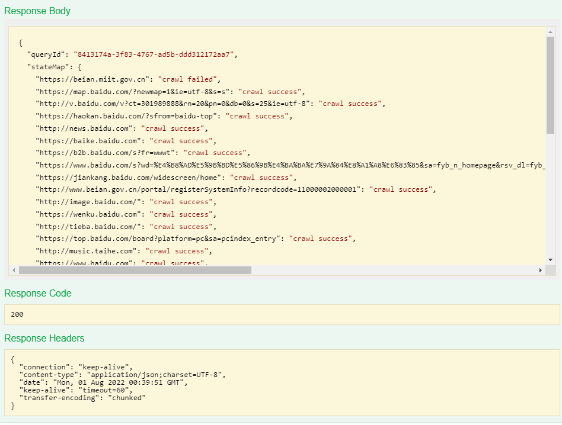

# web-crawler
This is a web crawler application which develop with Java. You can crawl a website and query content with this application.  

## API

The interfaces exposed to the current web crawler application are shown below (you can find detail information with below Swagger web page):

    /api/v1/crawl
    -- Crawl the specified web content and save, output the crawl results and a queryid 

    /api/v1/query
    -- Search specified text in crawled website, must with a query id.

### Query ID

Each crawl will be with a unique Query ID, with this query id you can search result in the special "crawl". As you know there maybe too many "crawls", so we need know which one you want to search. 

## Configuration

### Path

    src/main/resources/application.yaml

### Description

| Filed         | Description                                                       |
|:--------------|:------------------------------------------------------------------|
| maxUrlNum     | A request allows the max URLs number by client, default value: 10 |
| deepLevel     | Allows to query the depth of the url, default value: 0            |
| timeOutSecond | Maximum time to access a url in seconds, default value:30s        |

## Swagger

Use the address below to view the interface exposed:

    /api/swagger-ui.html

# How to use?

## Build Project

    mvn clean package

## Build Docker

    ./build.sh

## Run Docker

When you get the docker image you can run with below command:

    docker run -d -p 8080:8080 beck/web-crawler-application:1.0

## Example 

Crawl (with deep 1)

Search

## Drawback or future consideration

* UT coverage needs to be improved
* Crawl web content logic needs to be improved
* When crawl the web content, we can specify specific element tag, attributes, and class name
* The crawled page data we can save in to database, currently saved in memory, it is not a good way, and even I didn't provide a clean method
* High concurrent requests not support
